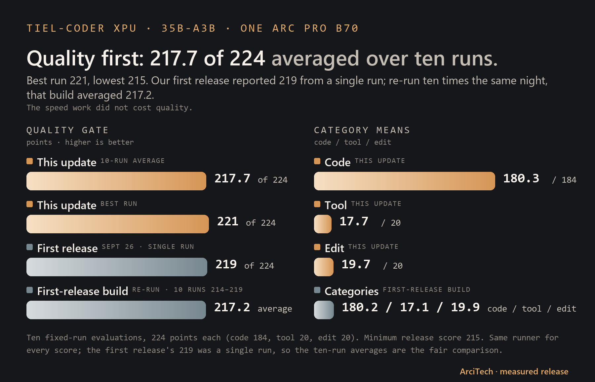
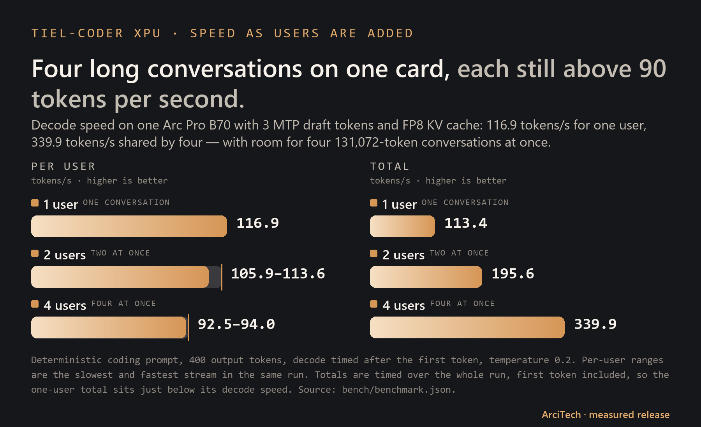
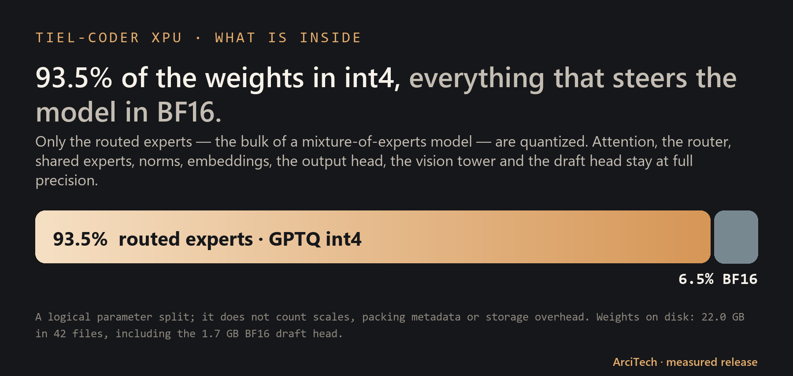
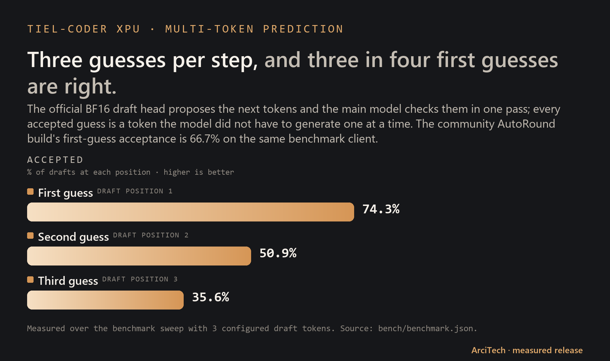

# Tiel-Coder 35B-A3B — GPTQ W4A16 for Intel Arc XPU

**Source:** [peculiar-ragdoll's Tiel-Coder-35B-A3B](https://huggingface.co/peculiar-ragdoll/Tiel-Coder-35B-A3B-GGUF-MTP), which is [Ornith-1.5-35B-A3B](https://huggingface.co/ornith-ai/Ornith-1.5-35B-A3B) with peculiar-ragdoll's [Sharp chat template](https://huggingface.co/peculiar-ragdoll/Qwen-Sharp-Chat-Templates). This build is quantized from Ornith's official BF16 weights and ships the same Tiel Sharp template.

[](LICENSE)
[](https://huggingface.co/arcitech-psp/Tiel-Coder-35B-A3B-W4A16-GPTQ-XPU-MTP)
[](https://github.com/arcitech-psp/vllm-xpu-arc)

<picture><source media="(prefers-color-scheme: dark)" srcset="assets/at-logo-white.png"></picture>


ArciTech's Arc-native build of Tiel-Coder — fast, and the highest-quality build
we measured. This repository holds the public data, scripts, charts, and
reproducibility notes; the weights are on
[Hugging Face](https://huggingface.co/arcitech-psp/Tiel-Coder-35B-A3B-W4A16-GPTQ-XPU-MTP).

## At a glance

- **Quality:** 217.7/224 as the mean of ten runs; the same-night baseline mean was 217.2.
- **Fast:** 144.4 tokens/s for one stream; 380.4 tokens/s across four.
- **Four 131,072-token conversations at once:** 526,012 KV tokens, or 4.01× capacity.
- **BF16-head acceptance screen:** 88.2%, 72.4%, and 54.8% at the three fixed-K3 positions.
- **93.5% of the weights in int4; everything that steers the model kept in BF16.**

## What we did to improve it

[Tiel-Coder](https://huggingface.co/peculiar-ragdoll/Tiel-Coder-35B-A3B-GGUF-MTP) is [Ornith-1.5-35B-A3B](https://huggingface.co/ornith-ai/Ornith-1.5-35B-A3B)'s weights with `peculiar-ragdoll`'s
[Sharp chat template](https://huggingface.co/peculiar-ragdoll/Qwen-Sharp-Chat-Templates). The existing ways to run it on Intel Arc forced a trade-off:
the [community GGUF build](https://huggingface.co/peculiar-ragdoll/Tiel-Coder-35B-A3B-GGUF) scored well but its MoE kernel topped out at two
concurrent chats, and the [faster int4 build](https://huggingface.co/biMEMO/Ornith-1.5-35B-A3B-int4-AutoRound-MTP) lost quality. We built our own:

1. **Our own quantization from the original BF16 weights.** GPTQ int4 on the
   routed experts only, with a separate activation-aware Hessian for every
   expert, calibrated on agentic coding and tool-use conversations, one decoder
   layer at a time with each layer's quantization error carried into the next.
2. **Kept the sensitive parts in full precision.** Attention, linear attention,
   shared experts, the router, norms, embeddings, output head, vision tower and
   the draft head stay in BF16 — that is where the quality is protected.
3. **Attached the official BF16 multi-token-prediction head** so the model
   drafts several tokens per step, correctly laid out for the loader; its
   guesses are accepted more often than the alternative build's.
4. **Packed it for the native fused int4 MoE kernel** in vLLM XPU, so four users
   share the card at full context instead of two.
5. **Built and tuned the runtime** ([vllm-xpu-arc](https://github.com/arcitech-psp/vllm-xpu-arc)):
   MTP on XPU, FP8 KV cache, and a configuration that fits four 131K-token
   conversations on 32 GB.

| Build on the same Arc Pro B70 | Internal eval (of 224) | Seconds per task | Concurrent 128K chats |
|---|---:|---:|---:|
| **This release (fixed-K3 GPTQ-A + draft INT4)** | **217.7 mean** | **144.4 / 380.4 tok/s** | **4** |
| [Community Tiel GGUF](https://huggingface.co/peculiar-ragdoll/Tiel-Coder-35B-A3B-GGUF) on vLLM | 216–217 | 1.23–1.27 | 2 |
| [Community AutoRound int4 + MTP](https://huggingface.co/biMEMO/Ornith-1.5-35B-A3B-int4-AutoRound-MTP) (biMEMO) | 213–215 | 0.34–0.35 | 4 |

The original published single-run score of 219 remains in the record. In the controlled ten-run
comparison, the new fixed route averaged 217.7 and the same-night baseline averaged 217.2;
the baseline runs ranged from 214 to 219, so 219 is within that run-to-run range.

Tokens per second (tokens/s) is how quickly generated text arrives. Higher is
faster; shared total speed is the combined output of several users.

## Test system

One ordinary AM4 desktop with one 32 GB workstation GPU — no datacenter hardware.
Everything below was read from the machine itself.

### Compute

| Part | Details |
|---|---|
| GPU — runs the model | **Intel Arc Pro B70**, 32 GB (30.3 GiB usable), 256 compute units, up to 2.8 GHz, on **PCIe 4.0 x16** (the card supports PCIe 5.0; the B550 board tops out at 4.0) |
| Second GPU — idle in these tests | Intel Arc A310 LP, 4 GB, on PCIe 3.0 x4 (chipset slot) |
| CPU | **AMD Ryzen 7 5800X**, 8 cores / 16 threads, 32 MB L3 + 4 MB L2 cache, up to 5.49 GHz as reported by the OS |

### Memory and storage

| Part | Details |
|---|---|
| System memory | **32 GB DDR4-3200**, 4 × 8 GB, dual channel |
| Motherboard | ASUS ROG Strix B550-F Gaming (AM4), PCIe 4.0 lanes from the CPU |
| Model storage — weights load from here | **Samsung PM9A1 1 TB NVMe**, PCIe 4.0 x4 |
| Other drive — archive only | WD Green 1.5 TB HDD; the model is not loaded from it |

### Usage while serving

| What | Amount |
|---|---|
| Model weights | **22.0 GB** (20.5 GiB) in 42 files, including the 1.7 GB draft (MTP) head |
| GPU memory reserved by vLLM | 97% of 30.3 GiB, about **29.4 GiB** (weights + KV cache + runtime) |
| KV cache | **526,012 tokens** in FP8 — room for 4.01 full 131,072-token conversations |
| Host memory in use | about 7.5 GB of 32 GB (spot reading with the vLLM server running) |

### Software

| Part | Details |
|---|---|
| OS | Ubuntu 24.04.4 LTS, Linux kernel 7.0 |
| Intel GPU driver | compute-runtime 26.22.38646.4 (Level Zero + OpenCL), Level Zero loader 1.28.6, IGC 2.11.12 |
| Serving stack | Docker 29.1.3, vLLM 0.27.2rc1.dev77+gac7509e2b ([custom XPU build](https://github.com/arcitech-psp/vllm-xpu-arc)), PyTorch 2.13.0+xpu, vllm-xpu-kernels 0.1.12.3 |
| Serving settings | FP8 KV cache, 131,072-token context, 4 concurrent sequences, 4,096 max batched tokens, 3 MTP draft tokens |

## Measured results



The original published single-run result of **219/224** remains historical context. The controlled
comparison below uses the same runner and same-night baseline; its ten runs ranged from 214 to 219.

| Build | 10-run mean | Run range | Code mean | Tool mean | Edit mean |
|---|---:|---:|---:|---:|---:|
| **Tiel-Coder XPU fixed-K3 + draft INT4** | **217.7** | **215–221** | **180.3** | **17.7** | **19.7** |
| Same-night published-build baseline | 217.2 | 214–219 | 180.2 | 17.1 | 19.9 |

The fixed route passed cold/warm identity and a 20-minute, four-chat soak with zero preemptions.



### Compared with our first release

| | First release (Sept 26) | This update | Change |
|---|---:|---:|---:|
| One user, decode | 116.9 tok/s | **148 tok/s** (median; best run 152) | **+27%** |
| Four users, total | 339.9 tok/s | **380.4 tok/s** | **+12%** |
| Four users, each | 92.5–94.0 tok/s | **102 tok/s** (median of 24; best 108) | **+9%** |
| Peak cell (8K prompt, 512 out) | — | **174.3 tok/s** | — |
| Quality (internal eval, /224) | 219 (single run) | **217.7 average of 10, best 221** | best run +2 |

Same card, same weights, same four 131K slots. For a strictly fair read: re-measured the same
night with this update's harness, the first-release build gives 132.7 tok/s (one user) and
373.1 (four users), so part of the jump is the more careful measurement and part is the new
serving route. Both comparisons are below.

### Speed as the context grows


| Prompt | 512 out | 128 out | Cookbook (512 / 128 out) |
|---|---:|---:|---:|
| 512 | 139.9 | 124.0 | 148.35 / 170.91 |
| 8K | **173.3** | 130.4 | 138.03 / 164.36 |
| 32K | 144.6 | 108.7 | — |
| 64K | 141.6 | 122.8 | — |
| Full 128K | **118.6** | **114.3** | 94.01 / 101.64 |

Tokens/s after the first token, median of three isolated requests on an idle server, same production build. A full 131K-token prompt takes about 63 s before the first token; after the 128K runs the server still reported 4.01x concurrency at 131K and 0 preemptions. Short replies are where this build trails the cookbook; long prompts are where it leads.

The speed table is the median of three blocks from the `tfinal_bench.sh` measurement, run back-to-back with the
baseline. Every cell uses the same deterministic `tfast_bench.py` method.

| Cell | Same-night re-run of the first-release build | This update | Change | Cookbook reference |
|---|---:|---:|---:|---:|
| bench, 1 stream | 132.7 | **144.4** | **+8.8%** | — |
| bench, 4 streams | 373.1 | **380.4** | **+2.0%** | — |
| 512 × 32 | 103.7 | **114.6** | **+10.5%** | 178.34 |
| 512 × 128 | 112.5 | **123.1** | **+9.4%** | 170.91 |
| 512 × 512 | 119.6 | **133.7** | **+11.8%** | 148.35 |
| 8192 × 32 | 107.6 | **109.4** | **+1.7%** | 156.28 |
| 8192 × 128 | 143.7 | **156.0** | **+8.6%** | 164.36 |
| 8192 × 512 | 166.9 | **174.3** | **+4.4%** | 138.03 |

All six cells beat the same-wrapper baseline. The long 8192 × 512 cell beats the
[public B70 cookbook](https://github.com/SergiioB/intel-arc-pro-b70-inference-cookbook)'s
138.03 reference; the short cells still trail its 178.34, 170.91, and 148.35 numbers.
The configurations differ: theirs is one user with 16-bit KV and a larger batch, while this
release keeps four 131K conversations with FP8 KV.





The BF16-head acceptance screen measured 88.2%, 72.4%, 54.8%, and 41.8% at positions 0–3.
Fixed K3 uses the first three; the fourth is retained from the K4 acceptance screen.

## How to read this

- **Token:** a small piece of text; words may be one or several tokens.
- **Tokens/s:** generated tokens per second, a practical speed measure.
- **MoE:** mixture of experts; only selected experts handle each token.
- **int4 / BF16:** compact 4-bit weights for routed experts and 16-bit weights for the retained tensors.
- **MTP:** multi-token prediction; a draft path proposes tokens for the main model to verify.
- **KV cache:** saved attention state that avoids recomputing the conversation so far.
- **Context:** the maximum amount of conversation the model can consider at once.

## For practitioners

### Method and precision boundary

We kept the parts that steer the model's behaviour in BF16 and quantized only
the routed expert projections. The export uses per-expert GPTQ, group size 128,
propagated hidden states, the official BF16 MTP head, and the Tiel [Sharp chat
template](https://huggingface.co/peculiar-ragdoll/Qwen-Sharp-Chat-Templates). Attention, Gated DeltaNet linear attention, shared experts, routing,
normalization, embeddings, the output head, the vision tower, and MTP tensors
remain BF16.

The public recipe starts from the BF16
[`ornith-ai/Ornith-1.5-35B-A3B`](https://huggingface.co/ornith-ai/Ornith-1.5-35B-A3B) source, gathers caller-owned activation statistics,
quantizes routed gate/up/down projections one layer at a time, and feeds the
dequantized hidden states into the next layer. The calibration conversations
and prompts are private and are not included here.

Packed weights use the compressed-tensors unsigned-nibble layout with an
implicit zero point of 8 and BF16 group scales. The supplied scripts are
sanitized reference recipes: they require caller-owned source and calibration
inputs and do not download or expose private calibration material.

### Measured serving method

The bounded client run used a deterministic coding prompt, temperature 0.2,
400 output tokens, decode timing after the first token, and concurrency 1, 2,
and 4. It also performed one tool-call and one reasoning transport smoke
check. The clients never start, stop, or configure a server.

The tested serving route is the custom
[vLLM XPU build](https://github.com/arcitech-psp/vllm-xpu-arc), using the
Tiel Sharp template, BF16 compute, FP8 KV cache, four 131,072-token slots,
4,096 maximum batched tokens, three MTP draft tokens, and the `qwen3_coder`
and `qwen3` parsers.

The fixed route is packaged in the vLLM repository as
[`scripts/serve-fast.sh`](https://github.com/arcitech-psp/vllm-xpu-arc/blob/main/scripts/serve-fast.sh),
with the BF16-boundary helpers, startup prewarm, and the
[`tfinal_bench.sh`](https://github.com/arcitech-psp/vllm-xpu-arc/blob/main/bench/tfinal_bench.sh)
median measurement. Its model path is supplied through `MODEL_DIR`; it does not embed a
developer-machine path.

### Reproduce the export

```bash
python scripts/quantize_tiel.py SOURCE_BF16 COMPRESSED_TENSORS_REFERENCE OUT CALIBRATION.jsonl
python scripts/make_bf16_mtp.py OUT BF16_MTP_REFERENCE OUT_WITH_MTP
```

The quantizer defaults to approximately 384 calibration windows of up to 2,048
tokens, batched in groups of four, with group size 128, block size 128,
symmetric int4, BF16 group scales, and damped per-expert Hessians. The exact
caller-owned calibration data is not part of this release.

## Limits and privacy

- Validated only on the tested Intel Arc Pro B70 and custom vLLM XPU build.
- CUDA, other Intel GPUs, and stock-vLLM equivalence are untested.
- The v0.30 rebase is experimental, unbuilt, and unserved; it is not the measured route.
- Long-context capacity is configuration- and driver-sensitive; the measured boundary is four 131,072-token slots.
- The internal quality comparison is not a public benchmark.
- No calibration data or private prompts are included.

## Credits

- [`peculiar-ragdoll`](https://huggingface.co/peculiar-ragdoll) — [Tiel-Coder-35B-A3B](https://huggingface.co/peculiar-ragdoll/Tiel-Coder-35B-A3B-GGUF-MTP)
  (the source this release is named after; also published as [GGUF](https://huggingface.co/peculiar-ragdoll/Tiel-Coder-35B-A3B-GGUF))
  and the [Sharp chat template](https://huggingface.co/peculiar-ragdoll/Qwen-Sharp-Chat-Templates) shipped with the model as `chat_template.jinja`.
- [Ornith team (`ornith-ai`)](https://huggingface.co/ornith-ai) — [Ornith-1.5-35B-A3B](https://huggingface.co/ornith-ai/Ornith-1.5-35B-A3B),
  the upstream model of Tiel-Coder, its official BF16 weights and MTP head, and MIT licensing.
- [biMEMO](https://huggingface.co/biMEMO) — [Ornith-1.5-35B-A3B-int4-AutoRound-MTP](https://huggingface.co/biMEMO/Ornith-1.5-35B-A3B-int4-AutoRound-MTP),
  earlier int4/MTP reference work and the AutoRound int4 + MTP build compared above.
- [Community Tiel GGUF](https://huggingface.co/peculiar-ragdoll/Tiel-Coder-35B-A3B-GGUF) by `peculiar-ragdoll` — the GGUF build compared above.
- [Intel Arc Pro B70 inference cookbook](https://github.com/SergiioB/intel-arc-pro-b70-inference-cookbook) by SergiioB — the public speed reference.
- [vLLM project](https://github.com/vllm-project/vllm) and Intel XPU contributors ([vllm-xpu-kernels](https://github.com/vllm-project/vllm-xpu-kernels)) — serving foundation and XPU work.
- Intel — Arc hardware and XPU software stack ([compute-runtime](https://github.com/intel/compute-runtime)).
- [Hugging Face](https://huggingface.co) community — models, tools, and practical feedback.

## Feedback

Please use the public [GitHub account `arcitech-psp`](https://github.com/arcitech-psp) for feedback.
[Hugging Face `arcitech-psp`](https://huggingface.co/arcitech-psp) hosts the model release.

## License and related pages

This data repository is MIT licensed as documented in `LICENSE`.

- [Tiel-Coder model card](https://huggingface.co/arcitech-psp/Tiel-Coder-35B-A3B-W4A16-GPTQ-XPU-MTP)
- [vLLM XPU repository](https://github.com/arcitech-psp/vllm-xpu-arc)
