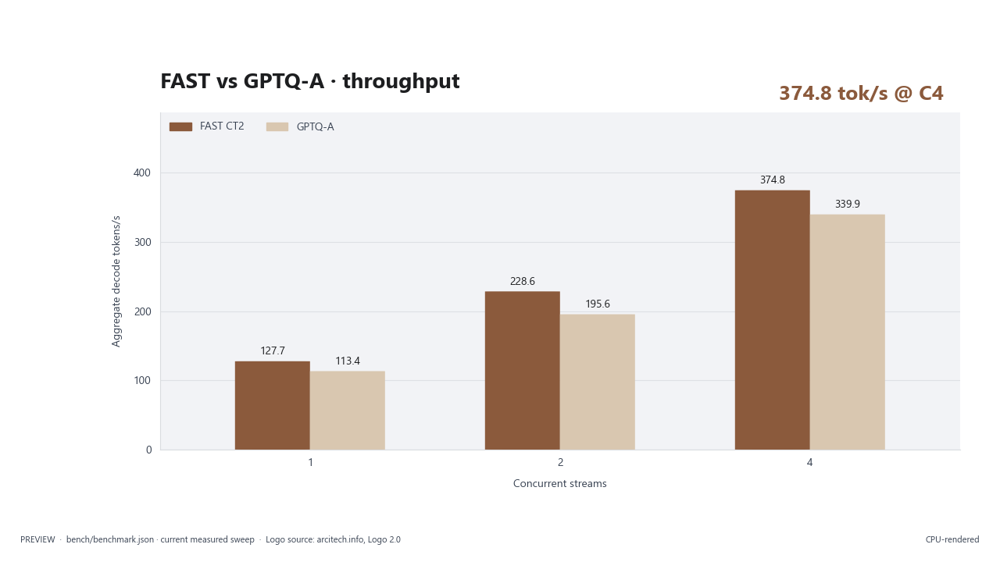

# Tiel-Coder 35B-A3B — GPTQ W4A16 for Intel Arc XPU

[](LICENSE)
[](https://huggingface.co/arcitech-psp/Tiel-Coder-35B-A3B-W4A16-GPTQ-XPU-MTP)
[](https://github.com/arcitech-psp/vllm-xpu-arc)

<picture><source media="(prefers-color-scheme: dark)" srcset="assets/arcitech-logo-white.png"></picture>
<picture><source media="(prefers-color-scheme: dark)" srcset="assets/hero-dark.png"></picture>

This repository is the public data, scripts, charts, and reproducibility notes
for [Tiel-Coder 35B-A3B GPTQ W4A16](https://huggingface.co/arcitech-psp/Tiel-Coder-35B-A3B-W4A16-GPTQ-XPU-MTP).
The model is an independent, experts-only GPTQ export of
`ornith-ai/Ornith-1.5-35B-A3B`, with the official BF16 MTP block preserved and
the Tiel Sharp chat template supplied by `peculiar-ragdoll`. We are only
trying to get something useful out there for people with Intel Arc hardware;
these are measured results from one tested path, not a promise of universal
compatibility.

<picture><source media="(prefers-color-scheme: dark)" srcset="assets/throughput-dark.png"></picture>

## What we did

We kept the parts that matter for the model's general behaviour in BF16 and
quantized only the routed expert projections. We used per-expert GPTQ with
group size 128, propagated each quantized layer's hidden states into the next
layer, attached the official BF16 MTP head, and served the result through the
tested custom vLLM XPU path. The calibration conversations are private and
are not part of this repository. The GitHub repository contains no model
weights and no calibration prompts; the weights belong on Hugging Face.

## Precision map

The logical parameter split is approximately 93.5% routed expert GPTQ int4
and 6.5% BF16 for the remaining tensors. This is a logical parameter view;
it does not count scales, packing metadata, or other storage overhead.

<picture><source media="(prefers-color-scheme: dark)" srcset="assets/precision_map-dark.png"></picture>
<picture><source media="(prefers-color-scheme: dark)" srcset="assets/layer_gptq_relative_error-dark.png"></picture>

The routed expert gate, up, and down projections are packed as compressed-
tensors unsigned nibbles with an implicit zero point of 8. Attention, Gated
DeltaNet linear attention, shared experts, router, norms, embeddings, output
head, vision tower, and MTP tensors remain BF16.

## Measured benchmark

These are the bounded client measurements shipped in `bench/`. They used one
Intel Arc Pro B70 with 32 GB, vLLM `0.27.2rc1.dev77+gac7509e2b`, PyTorch
`2.13.0+xpu`, FP8 KV cache, a 131,072-token maximum context, four sequence
slots, 4,096 maximum batched tokens, and MTP with three draft tokens.

The direct reference sweep used the sanitized `bench/bench8000_sanitized.py`
method: a deterministic coding prompt, temperature 0.2, 400 output tokens,
decode timing after the first token, and concurrency 1/2/4. The client also
performed one tool-call and one reasoning transport smoke check. The internal
quality comparison below is aggregate-only; no public task contents or
per-task records are included.

| Concurrent streams | GPTQ-A per-stream decode tok/s | GPTQ-A aggregate decode tok/s |
|---:|---:|---:|
| 1 | 116.9 | 113.4 |
| 2 | 105.9 / 113.6 | 195.6 |
| 4 | 94.0 / 92.5 / 92.5 / 93.0 | 339.9 |

Reference speed comparison (`/tmp/bench8000.py`; per-stream / aggregate
decode tok/s, with TTFT measured separately):

| Build | Concurrency 1 | Concurrency 2 | Concurrency 4 |
|---|---:|---:|---:|
| FAST CT2 | 132.0 / 127.7 | 120.8, 125.0 / 228.6 | 99.3, 101.1, 101.0, 100.4 / 374.8 |
| GPTQ-A | 116.9 / 113.4 | 105.9, 113.6 / 195.6 | 94.0, 92.5, 92.5, 93.0 / 339.9 |

### Internal quality comparison

The **internal 224-task agentic coding eval (tasks not released)** used the
same deterministic `eval/runner.py` settings and 100-task JSONL for both
builds. Only aggregate scores are published; task contents, private-work
references, and per-task records are not included. The FAST range is from two
recorded official-spec3 runs; GPTQ-A is the Q2 rerun.

| Build | Total | Code (184) | Tool (20) | Edit (20) |
|---|---:|---:|---:|---:|
| FAST CT2 | 213–215 / 224 | 176–178 | 18 | 19 |
| GPTQ-A | 219 / 224 | 181 | 18 | 20 |

GPTQ-A scored higher on this internal quality comparison; FAST CT2 was faster
on the reference decode measurement.

<picture><source media="(prefers-color-scheme: dark)" srcset="assets/mtp_acceptance-dark.png"></picture>

The matching direct-client MTP ratios by configured draft position were 74.3%,
50.9%, and 35.6%. Other draft counts were not measured in this bounded pass.
Only aggregate quality scores are included; task contents and per-task records
are not published.

The supplementary PP/TG helper and result are in `bench/pp_tg.json`. The
helpers are client-only and never start, stop, or configure a server.

## Quick start: tested vLLM XPU path

1. Download the model from the [Hugging Face model page](https://huggingface.co/arcitech-psp/Tiel-Coder-35B-A3B-W4A16-GPTQ-XPU-MTP).
2. Build the [vLLM XPU repository](https://github.com/arcitech-psp/vllm-xpu-arc) using its documented
   best-working path.
3. Set `MODEL_DIR` and `VLLM_XPU_IMAGE`, then run:

```bash
MODEL_DIR=/models/Tiel-Coder-35B-A3B-W4A16-GPTQ-XPU-MTP \
VLLM_XPU_IMAGE=VLLM_XPU_REPO_IMAGE \
bash scripts/serve-tiel-gptq.sh
```

The tested serving flags are kept in `scripts/serve-tiel-gptq.sh` and include
the Tiel Sharp template, BF16 compute, FP8 KV, 131,072 maximum context, four
sequence slots, 4,096 batched tokens, three MTP drafts, the multimodal pixel
limit, and the `qwen3_coder` and `qwen3` parsers.

Stock vLLM XPU 0.30.0 was attempted but did not reach a serving state: the
legacy prompt-token flag was rejected, the corrected run hit a SYCL top-k
warmup segfault, and a no-graph retry failed the XPU memory reservation.
CUDA and other Intel GPUs are untested.

## Reproduce the export

The scripts are sanitized reference recipes. They expect caller-owned source
and calibration inputs; those inputs are not distributed.

```bash
python scripts/quantize_tiel.py SOURCE_BF16 COMPRESSED_TENSORS_REFERENCE OUT CALIBRATION.jsonl
python scripts/make_bf16_mtp.py OUT BF16_MTP_REFERENCE OUT_WITH_MTP
```

The quantizer uses the BF16 source, approximately 384 calibration windows of
up to 2,048 tokens (the caller may set the script's environment controls),
group size 128, block size 128, symmetric int4, BF16 group scales, and damped
per-expert Hessians. It quantizes routed gate/up/down projections one layer at
a time and feeds the dequantized result forward before moving to the next
layer. The public description is intentionally limited to the method; the
calibration conversations and raw log remain private.

`make_bf16_mtp.py` takes only `mtp.*` tensors from an official BF16 reference,
leaves the quantized body unchanged, and writes the MTP block in the format
expected by the tested loader.

## Lessons for other quantizers

- Match the serving format exactly: compressed-tensors expects unsigned 0–15
  nibbles with an implicit zero point of 8.
- Quantize routed experts selectively when memory pressure is the main goal;
  keeping attention, shared experts, norms, embeddings, and MTP in BF16 makes
  the tradeoff easy to inspect.
- Per-expert Hessians need damping and a fallback for experts with sparse or
  dead columns.
- Propagating quantized hidden states during calibration exposes accumulated
  error that a layer-isolated measurement can miss.
- Use the official BF16 MTP tensors unless an independently validated graft is
  available. A fast-looking draft head is not enough if acceptance or output
  quality collapses.

## Limits and what's next

This release is validated only on the tested Intel Arc Pro B70 setup and the
custom vLLM XPU build. The internal quality comparison is not a public
benchmark and publishes aggregate scores only. Long-context capacity is
configuration- and driver-sensitive; the measured boundary was four
131,072-token slots.

Planned, not done: profile expert usage on representative workloads and
evaluate hot-expert offload. Those are future experiments, not capabilities
claimed by this release.

## Credits

Thank you to everyone whose work made this possible:

- The Ornith team for `ornith-ai/Ornith-1.5-35B-A3B` and its MIT licensing.
- `peculiar-ragdoll` for Tiel and the Sharp chat template.
- biMEMO for the earlier int4/MTP reference work that helped orient the
  comparison.
- The vLLM project and its Intel XPU contributors for the serving foundation.
- Intel for the Arc hardware and XPU software stack.
- The Hugging Face community for sharing models, tooling, and practical
  feedback.

Credit: GPT 5.6 Luna (Codex), directed by Claude.

## Feedback and contact

Please use the short feedback form when it is available:
[FEEDBACK_FORM_URL](FEEDBACK_FORM_URL). For direct contact, email
[parthpatel266@gmail.com](mailto:parthpatel266@gmail.com). The accounts for
this release are [GitHub `arcitech-psp`](https://github.com/arcitech-psp) and
[Hugging Face `arcitech-psp`](https://huggingface.co/arcitech-psp).

## Citation

```text
Tiel-Coder 35B-A3B GPTQ W4A16 for Intel Arc XPU, 2026.
Independent experts-only GPTQ export of Ornith-1.5-35B-A3B with the
official BF16 MTP block and Tiel Sharp chat template.
Model: https://huggingface.co/arcitech-psp/Tiel-Coder-35B-A3B-W4A16-GPTQ-XPU-MTP
Data and scripts: https://github.com/arcitech-psp/tiel-coder-xpu
Serving build: https://github.com/arcitech-psp/vllm-xpu-arc
```
