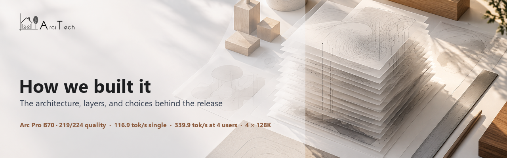
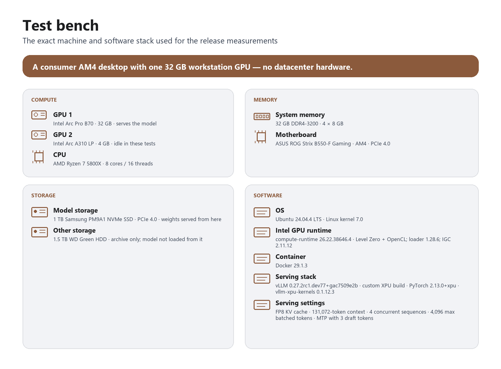
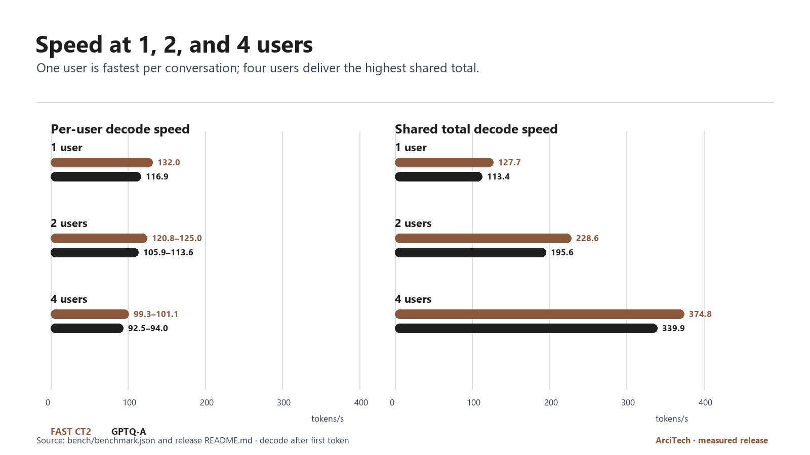
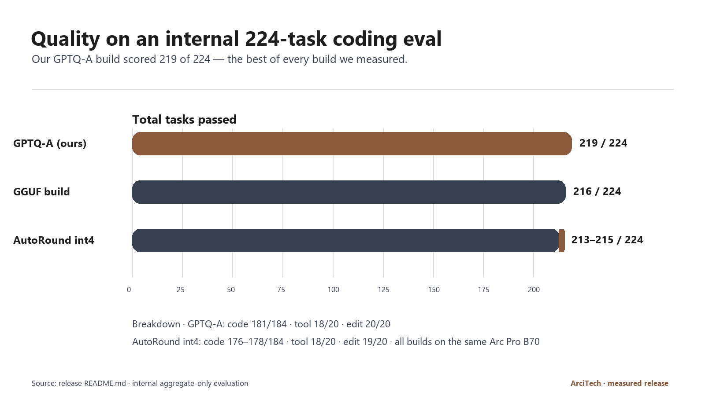
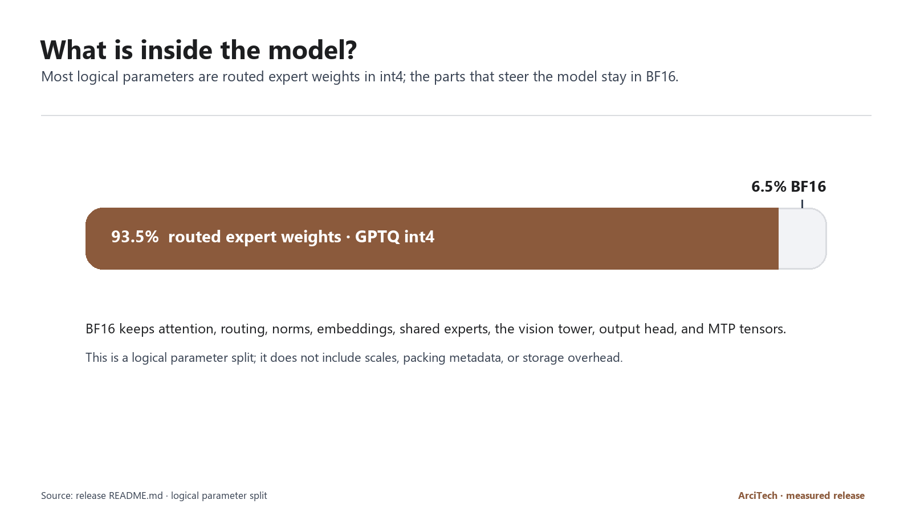
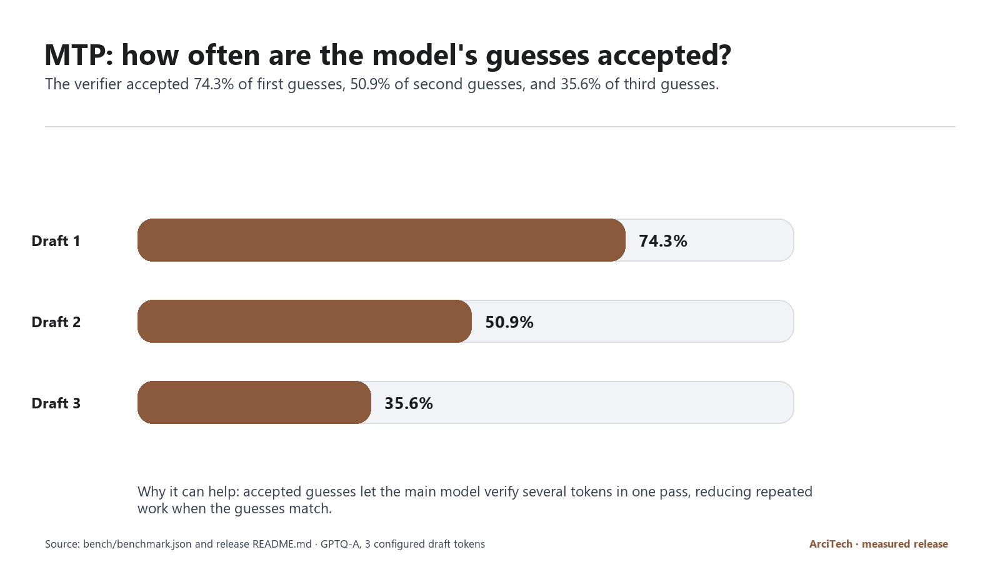

# Tiel-Coder 35B-A3B — GPTQ W4A16 for Intel Arc XPU

[](LICENSE)
[](https://huggingface.co/arcitech-psp/Tiel-Coder-35B-A3B-W4A16-GPTQ-XPU-MTP)
[](https://github.com/arcitech-psp/vllm-xpu-arc)

<picture><source media="(prefers-color-scheme: dark)" srcset="assets/arcitech-logo-white.png"></picture>
<picture><source media="(prefers-color-scheme: dark)" srcset="assets/hero-dark.png"></picture>

ArciTech's Arc-native build of Tiel-Coder — fast, and the highest-quality build
we measured. This repository holds the public data, scripts, charts, and
reproducibility notes; the weights are on
[Hugging Face](https://huggingface.co/arcitech-psp/Tiel-Coder-35B-A3B-W4A16-GPTQ-XPU-MTP).

## At a glance

- **Best quality we measured:** 219 of 224 on our internal agentic coding
  evaluation, ahead of the community GGUF build (216) and the AutoRound int4
  build (213–215).
- **Fast:** 116.9 tokens/s for one user; 339.9 tokens/s shared across four.
- **Four 131,072-token conversations at once** on one 32 GB card.
- **Better draft acceptance:** 74.3% of first speculative guesses accepted,
  against 66.7% for the AutoRound int4 build.
- **93.5% of the weights in int4; everything that steers the model kept in BF16.**

## What we did to improve it

Tiel-Coder is Ornith-1.5-35B-A3B's weights with `peculiar-ragdoll`'s Sharp
chat template. The existing ways to run it on Intel Arc forced a trade-off:
the community GGUF build scored well but its MoE kernel topped out at two
concurrent chats, and the faster int4 build lost quality. We built our own:

1. **Our own quantization from the original BF16 weights.** GPTQ int4 on the
   routed experts only, with a separate activation-aware Hessian for every
   expert, calibrated on agentic coding and tool-use conversations, one decoder
   layer at a time with each layer's quantization error carried into the next.
2. **Kept the sensitive parts in full precision.** Attention, linear attention,
   shared experts, the router, norms, embeddings, output head, vision tower and
   the draft head stay in BF16 — that is where the quality is protected.
3. **Attached the official BF16 multi-token-prediction head** so the model
   drafts several tokens per step, correctly laid out for the loader; its
   guesses are accepted more often than the alternative build's.
4. **Packed it for the native fused int4 MoE kernel** in vLLM XPU, so four users
   share the card at full context instead of two.
5. **Built and tuned the runtime** ([vllm-xpu-arc](https://github.com/arcitech-psp/vllm-xpu-arc)):
   MTP on XPU, FP8 KV cache, and a configuration that fits four 131K-token
   conversations on 32 GB.

| Build on the same Arc Pro B70 | Internal eval (224 tasks) | Concurrent 128K chats | 1 user / 4 users (tok/s) |
|---|---:|---:|---:|
| **This release (GPTQ-A, ours)** | **219** | **4** | 116.9 / 339.9 |
| AutoRound int4 build, repacked | 213–215 | 4 | 132.0 / 374.8 |
| Community GGUF build (k-quant) | 216 | 2 | — (earlier campaign; not the same speed method) |

The result is the best-scoring build we measured, within about 10% of the
fastest one.

Tokens per second (tokens/s) is how quickly generated text arrives. Higher is
faster; shared total speed is the combined output of several users.

<picture><source media="(prefers-color-scheme: dark)" srcset="assets/test-bench-dark.png"></picture>

## Test system

The short version: a consumer AM4 desktop with one 32 GB workstation GPU — no
datacenter hardware.

<details>
<summary>Full test system</summary>

| Part | Value |
|---|---|
| GPU 1 (serves the model) | Intel Arc Pro B70, 32 GB |
| GPU 2 (in the machine, not used for these tests) | Intel Arc A310 LP, 4 GB |
| CPU | AMD Ryzen 7 5800X, 8 cores / 16 threads |
| System memory | 32 GB DDR4-3200 (4 × 8 GB) |
| Motherboard | ASUS ROG Strix B550-F Gaming (AM4, PCIe 4.0) |
| Model storage (weights served from here) | 1 TB Samsung PM9A1 NVMe SSD (PCIe 4.0) |
| Other storage (archive only; the model was not loaded from it) | 1.5 TB WD Green HDD |
| OS | Ubuntu 24.04.4 LTS, Linux kernel 7.0 |
| Intel GPU runtime | compute-runtime 26.22.38646.4 (Level Zero + OpenCL), Level Zero loader 1.28.6, IGC 2.11.12 |
| Container | Docker 29.1.3 |
| Serving stack | vLLM 0.27.2rc1.dev77+gac7509e2b (custom XPU build, `vllm-xpu-arc`), PyTorch 2.13.0+xpu, vllm-xpu-kernels 0.1.12.3 |
| Serving settings | FP8 KV cache, 131,072-token context, 4 concurrent sequences, 4,096 max batched tokens, MTP with 3 draft tokens |

</details>

## Results for a general audience

### Speed: one user or a shared queue

<picture><source media="(prefers-color-scheme: dark)" srcset="assets/speed-comparison-dark.png"></picture>

GPTQ-A is the release build. FAST CT2 is the comparison build from the
community AutoRound quant, measured with the same reference method. The speed
chart shows both a single conversation's pace and the combined pace when users
share the model.

| Build | 1 user | 2 users | 4 users |
|---|---:|---:|---:|
| GPTQ-A (this release), per-stream / aggregate tok/s | 116.9 / 113.4 | 105.9, 113.6 / 195.6 | 94.0, 92.5, 92.5, 93.0 / 339.9 |
| FAST CT2, per-stream / aggregate tok/s | 132.0 / 127.7 | 120.8, 125.0 / 228.6 | 99.3, 101.1, 101.0, 100.4 / 374.8 |

### Quality: the internal coding check

<picture><source media="(prefers-color-scheme: dark)" srcset="assets/quality-comparison-dark.png"></picture>

The internal 224-task agentic coding evaluation is aggregate-only. The task
prompts, private references, and per-task records are not released.

| Build | Total | Code (184) | Tool (20) | Edit (20) |
|---|---:|---:|---:|---:|
| GPTQ-A (this release) | 219 / 224 | 181 | 18 | 20 |
| FAST CT2 (comparison) | 213–215 / 224 | 176–178 | 18 | 19 |

GPTQ-A scored higher on this internal quality comparison; FAST CT2 was faster
on the reference decode measurement.

### What is inside?

<picture><source media="(prefers-color-scheme: dark)" srcset="assets/precision-split-dark.png"></picture>

The logical parameter split is approximately 93.5% routed expert GPTQ int4 and
6.5% BF16. This is a logical parameter view; it does not count scales, packing
metadata, or other storage overhead.

### MTP: accepted guesses can reduce repeated work

<picture><source media="(prefers-color-scheme: dark)" srcset="assets/mtp-acceptance-dark.png"></picture>

Multi-token prediction (MTP) proposes a few tokens ahead. The main model checks
those guesses; accepted guesses let it verify several tokens in one pass.
GPTQ-A acceptance by configured draft position was 74.3%, 50.9%, and 35.6%.

## How to read this

- **Token:** a small piece of text; words may be one or several tokens.
- **Tokens/s:** generated tokens per second, a practical speed measure.
- **MoE:** mixture of experts; only selected experts handle each token.
- **int4 / BF16:** compact 4-bit weights for routed experts and 16-bit weights for the retained tensors.
- **MTP:** multi-token prediction; a draft path proposes tokens for the main model to verify.
- **KV cache:** saved attention state that avoids recomputing the conversation so far.
- **Context:** the maximum amount of conversation the model can consider at once.

## For practitioners

### Method and precision boundary

We kept the parts that steer the model's behaviour in BF16 and quantized only
the routed expert projections. The export uses per-expert GPTQ, group size 128,
propagated hidden states, the official BF16 MTP head, and the Tiel Sharp chat
template. Attention, Gated DeltaNet linear attention, shared experts, routing,
normalization, embeddings, the output head, the vision tower, and MTP tensors
remain BF16.

The public recipe starts from the BF16
`ornith-ai/Ornith-1.5-35B-A3B` source, gathers caller-owned activation statistics,
quantizes routed gate/up/down projections one layer at a time, and feeds the
dequantized hidden states into the next layer. The calibration conversations
and prompts are private and are not included here.

Packed weights use the compressed-tensors unsigned-nibble layout with an
implicit zero point of 8 and BF16 group scales. The supplied scripts are
sanitized reference recipes: they require caller-owned source and calibration
inputs and do not download or expose private calibration material.

### Measured serving method

The bounded client run used a deterministic coding prompt, temperature 0.2,
400 output tokens, decode timing after the first token, and concurrency 1, 2,
and 4. It also performed one tool-call and one reasoning transport smoke
check. The clients never start, stop, or configure a server.

The tested serving route is the custom
[vLLM XPU build](https://github.com/arcitech-psp/vllm-xpu-arc), using the
Tiel Sharp template, BF16 compute, FP8 KV cache, four 131,072-token slots,
4,096 maximum batched tokens, three MTP draft tokens, and the `qwen3_coder`
and `qwen3` parsers.

### Reproduce the export

```bash
python scripts/quantize_tiel.py SOURCE_BF16 COMPRESSED_TENSORS_REFERENCE OUT CALIBRATION.jsonl
python scripts/make_bf16_mtp.py OUT BF16_MTP_REFERENCE OUT_WITH_MTP
```

The quantizer defaults to approximately 384 calibration windows of up to 2,048
tokens, batched in groups of four, with group size 128, block size 128,
symmetric int4, BF16 group scales, and damped per-expert Hessians. The exact
caller-owned calibration data is not part of this release.

## Limits and privacy

- Validated only on the tested Intel Arc Pro B70 and custom vLLM XPU build.
- CUDA, other Intel GPUs, and stock-vLLM equivalence are untested.
- The v0.30 rebase is experimental, unbuilt, and unserved; it is not the measured route.
- Long-context capacity is configuration- and driver-sensitive; the measured boundary is four 131,072-token slots.
- The internal quality comparison is not a public benchmark.
- No calibration data or private prompts are included.

## Credits

- The Ornith team for `ornith-ai/Ornith-1.5-35B-A3B` and its MIT licensing.
- `peculiar-ragdoll` for Tiel and the Sharp chat template.
- biMEMO for earlier int4/MTP reference work.
- The vLLM project and Intel XPU contributors for the serving foundation.
- Intel for the Arc hardware and XPU software stack.
- The Hugging Face community for models, tooling, and practical feedback.

## Feedback and contact

Feedback form: [Google Form](https://docs.google.com/forms/d/1gaUBeulGlZwo8gt4eucGpg3biCKy-tli79urdTesXSI/viewform).
Direct contact: [parthpatel266@gmail.com](mailto:parthpatel266@gmail.com).
Release accounts: [GitHub `arcitech-psp`](https://github.com/arcitech-psp) and
[Hugging Face `arcitech-psp`](https://huggingface.co/arcitech-psp).

## License and related pages

This data repository is MIT licensed as documented in `LICENSE`.

- [Tiel-Coder model card](https://huggingface.co/arcitech-psp/Tiel-Coder-35B-A3B-W4A16-GPTQ-XPU-MTP)
- [vLLM XPU repository](https://github.com/arcitech-psp/vllm-xpu-arc)
- [How Tiel-Coder XPU was built](../docs/APPROACH.md)
